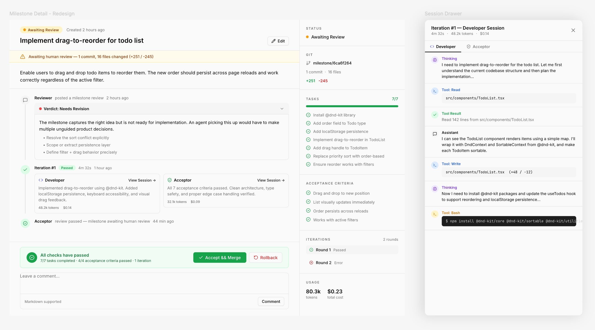

<p align="center">
  
</p>
<p align="center">
  <h1 align="center">Anima</h1>
  <p align="center"><b>Give your project a soul.</b></p>
  <p align="center">
    A desktop app that drives software projects through autonomous, AI-powered development cycles.
  </p>
</p>

<p align="center">
  <a href="https://github.com/saltbo/anima/actions/workflows/ci.yml"></a>
  <a href="https://github.com/saltbo/anima/releases/latest"></a>
  <a href="https://github.com/saltbo/anima/blob/master/LICENSE"></a>
  <a href="https://discord.gg/72bzB5KaDC"></a>
</p>

<p align="center">
  <a href="#features">Features</a> &bull;
  <a href="#how-it-works">How It Works</a> &bull;
  <a href="#installation">Installation</a> &bull;
  <a href="#supported-agents">Supported Agents</a> &bull;
  <a href="#community">Community</a> &bull;
  <a href="#contributing">Contributing</a> &bull;
  <a href="#license">License</a>
</p>

## Project Status

> **Active Development** — Anima is under active development and things change fast. We welcome [issues](https://github.com/saltbo/anima/issues) for bug reports, feature requests, and ideas.

As an autonomous development tool, Anima is progressively moving toward **driving its own development**. The goal is for Anima to plan, implement, and verify its own milestones — eating its own dog food.

**This project does not accept Pull Requests.** Anima is built by its maintainers and, increasingly, by itself. If you have ideas, feedback, or bug reports, please [open an issue](https://github.com/saltbo/anima/issues). Your input shapes the direction; Anima writes the code.

## What is Anima?

Anima is an Electron desktop application that turns your software projects into living entities. It continuously senses the gap between where your project is and where it should be, then autonomously plans, executes, verifies, and commits changes — iteration after iteration — powered by AI coding agents.

You define the vision. Anima does the rest.

## Features

- **Autonomous Iteration** — Runs a continuous loop: sense the project state, decide what to do next, act through AI agents.
- **Multi-Project Management** — Manage multiple projects from a single dashboard. Each project gets its own "Soul" that runs independently.
- **Milestone-Driven Development** — Break your vision into milestones. Anima plans tasks, executes them, and iterates until each milestone is complete.
- **Human-in-the-Loop Review** — Works autonomously but pauses for your review at key checkpoints. Accept, request changes, or roll back.
- **Agent Session Tracking** — Full visibility into every AI agent invocation, including token usage and cost.

<p align="center">
  
</p>

## How It Works

Each project in Anima has a **Soul** — a heartbeat-driven loop that follows a sense-think-act cycle:

```
sense → think → act → sleep → wake → repeat
```

1. **Sense** — Read the project state: git status, milestone progress, pending feedback.
2. **Think** — Decide the next action: start a milestone, continue an iteration, wait for review.
3. **Act** — Dispatch AI coding agents to execute the plan via MCP tools.
4. **Sleep** — Wait for the next trigger: a timer, a human action, or a project event.

## Installation

### Prerequisites

- One of the [supported coding agents](#supported-agents) installed and authenticated.

### Download

Download the latest release for your platform from the [Releases](https://github.com/saltbo/anima/releases) page:

| Platform | Format |
|----------|--------|
| macOS (Apple Silicon) | `.dmg` (arm64) |
| macOS (Intel) | `.dmg` (x64) |
| Windows | `.exe` |

### Homebrew (macOS)

```bash
brew install saltbo/tap/anima
```

## Supported Agents

Anima is designed to work with multiple AI coding agents. Current support status:

| Agent | Status |
|-------|--------|
| [Claude Code](https://docs.anthropic.com/en/docs/claude-code) | Supported |
| [Gemini CLI](https://github.com/google-gemini/gemini-cli) | Planned |
| [OpenAI Codex](https://github.com/openai/codex) | Planned |
| [Aider](https://github.com/paul-gauthier/aider) | Planned |
| [Cline](https://github.com/cline/cline) | Planned |

Want support for another agent? [Open an issue](https://github.com/saltbo/anima/issues).

## Community

- [Discord](https://discord.gg/72bzB5KaDC) — Chat, ask questions, share what you're building with Anima.
- [GitHub Discussions](https://github.com/saltbo/anima/discussions) — Longer-form discussions, ideas, and RFCs.
- [GitHub Issues](https://github.com/saltbo/anima/issues) — Bug reports and feature requests.

## Contributing

This project does not accept Pull Requests. Please [open an issue](https://github.com/saltbo/anima/issues) to report bugs, suggest features, or discuss ideas. Your input shapes the direction; Anima writes the code.

For architecture details and local development setup, see the [Contributing Guide](CONTRIBUTING.md).

## License

[Apache-2.0](LICENSE)
